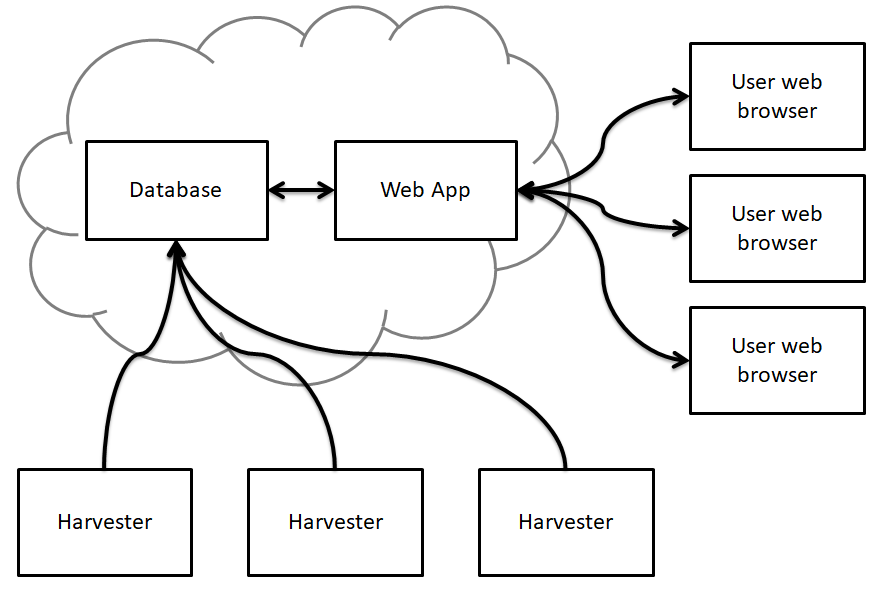

Galvanalyser is a system for automatically storing data generated by battery cycling 
machines in a database in a standard format.
The project contains several distinct components:

- A REST API 
  - A Python client for the REST API
  - A web frontend for the REST API
- [Harvesters](docs/UserGuide.md#Harvesters) that monitor and process experimental data

A laboratory running a [Galvanalyser server](docs/UserGuide.md#Server) instance and a battery 
cycling machines can use Galvanalyser to make it easy to access, analyse, and 
share their experimental data. 
To do this, they:
1. Set the cycling machines up to output their raw test result files to a shared drive. 
2. Set up a [harvester](docs/UserGuide.md#Harvesters) on a computer with access to that shared drive.
    - (This only needs to be done once)
3. Log into their lab [Web frontend](docs/UserGuide.md#Web-frontend) and configure the
    [harvester](docs/UserGuide.md#Harvesters) to crawl the appropriate directories on the shared drive.
4. Log into the [Web frontend](docs/UserGuide.md#Web-frontend) to edit metadata and view data,
    or use the [Python client](docs/UserGuide.md#Python-client) to download formatted data for analysis.

The harvesters are able to parse the following file types:

- MACCOR files in .txt, .xsl/.xslx, or raw format
- Ivium files in .idf format
- Biologic files in .mpr format

The server database is a relational database that stores each dataset along with information 
about column types, units, and other relevant metadata (e.g. cell information, owner, purpose 
of the experiment).
The [REST API](docs/UserGuide.md#REST-API) provides its own definition via a downloadable OpenAPI schema file 
(`schema/`), and provides interactive documentation via SwaggerUI (`schema/swagger-ui/`) and
Redoc (`schema/redoc/`).

A diagram of the logical structure of the system is shown below. The arrows indicate the 
direction of data flow.

## Project documentation

The `docs` directory contains more detailed documentation on a number of topics. 
It contains the following items:
- [FirstTimeQuickSetup.md](docs/FirstTimeQuickSetup.md) - A quick start guide to 
  setting up your first complete Galvanalyser system
  - Installing Galvanalyser server
  - Setting up a Harvester
  - Checking your setup
- [UserGuide.md](docs/UserGuide.md) - A detailed guide for Galvanalyser users
  - [Galvanalyser server](docs/UserGuide.md#Galvanalyser-server)
  - [REST API](docs/UserGuide.md#REST API)
  - [User accounts](docs/UserGuide.md#User-accounts)
  - [Web interface](docs/UserGuide.md#Web-interface)
  - [Python client](docs/UserGuide.md#Python client)
  - [Harvesters](docs/UserGuide.md#Harvesters)
- [DevelopmentGuide.md](docs/DevelopmentGuide.md) - A guide for developers on 
  Galvanalyser
  - Technology used
  - Creating a testing instance
  - Running tests
  - Contributor guide

## Technology used

This section provides a brief overview of the technology used to implement the different parts of the project.

### Docker

Dockerfiles are provided to run all components of this project in containers. A docker-compose file exists to simplify starting the complete server side system including the database, the web app and the Nginx server. All components of the project can be run natively, however using Docker simplifies this greatly.

A Docker container is also used for building the web app and its dependencies to simplify cross platform deployment and ensure a consistent and reliable build process.

### Backend server

The server is a [Flask](flask.palletsprojects.com) web application, which uses 
[SQLAlchemy](https://www.sqlalchemy.org/) and [psycopg2](https://www.psycopg.org/) to 
interface with the Postgres database.

### Harvesters 

The harvesters are python modules in the backend server which monitor directories for 
tester datafiles, parse them according to the their format and write the data and any 
metadata into the Postgres database. The running of the harvesters, either periodically 
or manually by a user, is done using a [Celery](https://docs.celeryproject.org/) 
distributed task queue.

### Frontend web application

The frontend is written using Javascript, the [React](https://reactjs.org/) framework 
and using [Material-UI](https://material-ui.com/) components.

### Database

The project uses PostgreSQL for its database. Other databases are currently not 
supported. An entity relationship diagram is shown below.

### Harvester permissions

| Action           | User status   |
|------------------|---------------|
| View harvester   | Users, Admins |
| View paths       | Users, Admins |
| Add paths        | Users, Admins |
| Edit harvester   | Admins        |
| Delete harvester | Admins        |

### Path permissions

| Action      | User status   |
|-------------|---------------|
| View files  | Users, Admins |
| Edit path   | Admins        |
| Delete path | Admins        |

All Harvester Admins are Admins on all paths on that Harvester.

### Running Tests

- The Harvester code has its own tests, in `harvester/test`. These are run with `unittest`.
- The Django backend has Django Rest Framework tests, using `FactoryBoy` and `Faker`.
  - Run with `docker compose -f docker-compose.test.yml up`

### Generate OpenAPI schema

The OpenAPI schema is generated by `drf_spectacular` and available from the `/schema/` endpoint. 
For json format, use `/schema/?format=json`.
