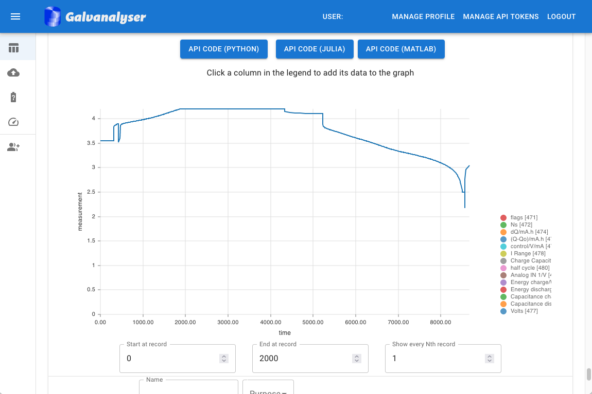
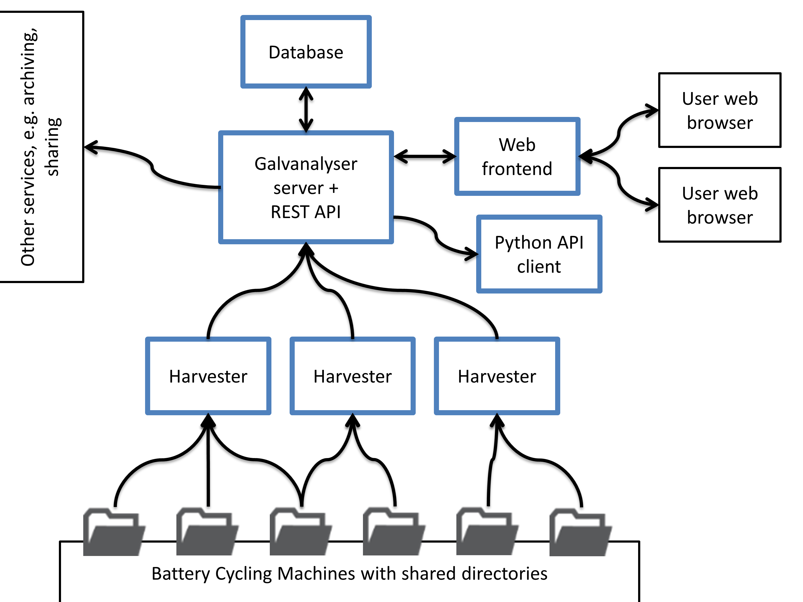

# 🚨Galv has moved🚨

Galv has moved to separate repositories for the [backend](https://github.com/Battery-Intelligence-Lab/galv-backend), [frontend](https://github.com/Battery-Intelligence-Lab/galv-frontend), and [harvester](https://github.com/Battery-Intelligence-Lab/galv-harvester).
Future changes will be made to those repositories rather than this one. 
Please target issues at the relevant one of those repositories. 

Galv v2 has a rewritten structure providing more flexibility, better interlinking of resources, and a more streamlined codebase.

# Readme

<a href="https://Battery-Intelligence-Lab.github.io/galv/" target="_blank">
    
</a>

Galv is an open-source platform for automated storage of battery data with advanced metadata support for battery scientists. Galv is deployed with [Docker](https://docs.docker.com/) to support robust local and cloud instances. An example frontend view is displayed below. 

## Features:
- REST API for easy data storage and retrieval
- A Python, Julia, and MATLAB client for the REST API
- Metadata support using ontology definitions from BattINFO/EMMO
- A distributed platform with local data harvesters
- Docker based deployment

## Getting Started
Deploying a [Galv](https://Battery-Intelligence-Lab.github.io/galv/UserGuide.html#galv-server) instance in a battery lab can make it easy to access, analyse, and share experimental data. The steps to achieve this are:
1. Set the cycler's data export/save location to a single directory.

2. Set up a [harvester](https://Battery-Intelligence-Lab.github.io/galv/UserGuide.html#harvesters) on a computer with access to the directory (can be local or via a shared directory/drive).

3. Deploy Galv onto a local machine, or onto a cloud instance. Selection between these depend on security and access requirements. Note, network connection between the harvester and the Galv instance is necessary.

4. Log into the lab [web frontend](https://Battery-Intelligence-Lab.github.io/galv/UserGuide.html#web-frontend) and configure the [harvester](https://Battery-Intelligence-Lab.github.io/galv/UserGuide.html#harvesters) to crawl the appropriate directories.

5. Use the [web frontend](https://Battery-Intelligence-Lab.github.io/galv/UserGuide.html#web-frontend) to add metadata and view data, or use the [Python](https://Battery-Intelligence-Lab.github.io/galv/UserGuide.html#python-client) client to ingest the data for analysis.

The harvesters are able to parse the following file types:

- MACCOR files in ``.txt``, ``.xsl``/``.xslx``, or ``raw`` format
- Ivium files in ``.idf`` format
- Biologic files in ``.mpr`` format (EC-Lab firmware < 11.50)

Galv uses a relational database that stores each dataset along with information about column types, units, and other relevant metadata (e.g. cell information, owner, purpose of the experiment). The [REST API](https://Battery-Intelligence-Lab.github.io/galv/UserGuide.html#rest-api) provides its own definition via a downloadable OpenAPI schema file (`schema/`), and provides interactive documentation via SwaggerUI (`schema/swagger-ui/`) and Redoc (`schema/redoc/`).

The schema can be downloaded from the [documentation page](https://Battery-Intelligence-Lab.github.io/galv/UserGuide.html#api-spec). The below diagram presents an overview of Galv's architecture. The arrows indicate the direction of data flow.

    

## Project documentation

Full documentation is available [here](https://Battery-Intelligence-Lab.github.io/galv/), build by Sphinx from `./docs/source/*.rst`.
