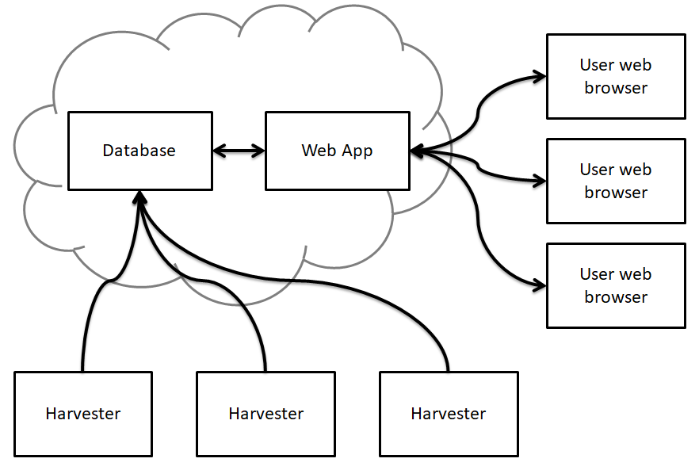
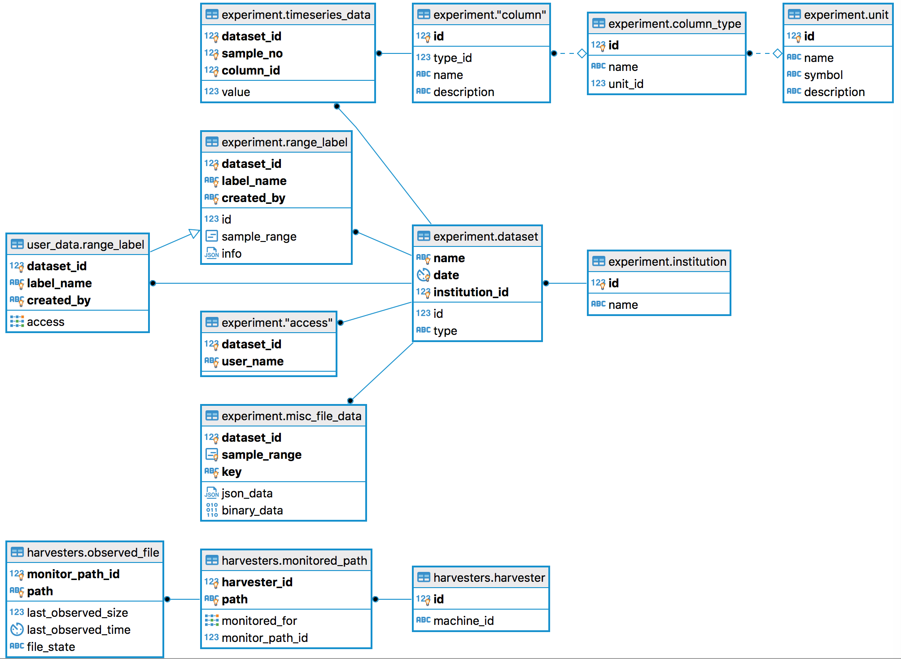

# Galvanalyser project

Galvanalyser is a system for automatically storing data generated by battery cycling machines in a database and presenting that data to users with a web app. The system has three main parts: the database; the web app; and the harvesters. A relational database is used for storing the data cycler data. The web app which serves the data from the database to web browsers allows users to search and list available datasets and produce, interact with, and export plots of the data. The web app also allows users to annotate data and add metadata to the datasets. A harvester is a program which runs on the computer with the cycler data and monitors a folder for new cycler data, when it detects new data it will insert it into the database. A diagram of the logical structure of the system is shown below. The arrows indicate the direction of data flow.

## Project documentation

The `documentation` directory contains more detailed documentation on a number of topics. It contains the following items:
* [FirstTimeQuickSetup.md](./documentation/FirstTimeQuickSetup.md) - A quick start guide to setting up your first complete Galvanalyser system
* [ADMINISTRATION-GUIDE.md](./documentation/ADMINISTRATION-GUIDE.md) - A guide to performing administration tasks such as creating users and setting up harvesters
* [ProjectStructure.md](./documentation/ProjectStructure.md) - An overview of the project folder structure to guide developers to the locations of the various parts of the project
* [TheMakefile.md](./documentation/TheMakefile.md) - A description of the use of this project's Makefile

## Technology used

This section provides a brief overview of the technology used to implement the different parts of the project.

### Docker

Dockerfiles are provided to run all components of this project in containers. A docker-compose file exists to simplify starting the complete server side system including the database, the web app and the Nginx server. All components of the project can be run natively, however using Docker simplifies this greatly.

A Docker container is also used for building the web app and its dependencies to simplify cross platform deployment and ensure a consistent and reliable build process.

### Harvester

The harvesters are Python3 command line applications. A Dockerfile is provided allowing one to run a harvester as a docker container with the source data directory mounted as a volume in the container.

### Web App

The web app is a Flask based Python3 app that uses the Dash framework which is based on React. It uses Plotly for plotting the data and uses webgl acceleration where available. This project uses some custom Dash components. The web app transfers time series data in a binary form using Google Protobufs which are compressed by Nginx before being sent to the clients. A custom JavaScript library is used client side to avoid requesting duplicate data. Users login to the web app using their database login details and the web app server authenticates these by attempting to connect to the database. Login sessions are persisted by storing the login details in encrypted cookies for which only the web app server has the decrypting keys. The datasets visible to the user are limited to what datasets their database account has permission to view.

### Database

The project uses PostgreSQL for its database. Other databases are currently not supported. Visibility of data is restricted using row level security. An entity relationship diagram is shown below.

